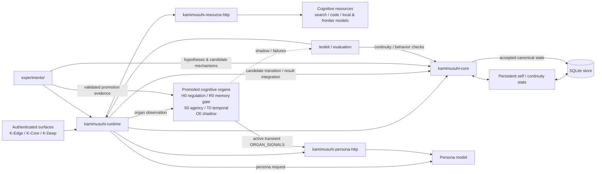
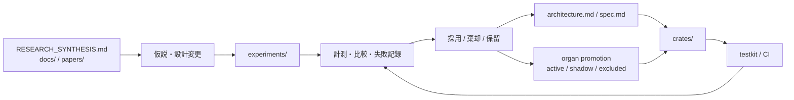

# Kamimusuhi repository structure

この文書は、Kamimusuhi の**現在のリポジトリ構成**と、`architecture.md` / `spec.md` が定義する**概念アーキテクチャとの対応**を素早く把握するための入口です。

> `architecture.md` は目標アーキテクチャの正本です。ここでは「どこに何があるか」を中心に示し、概念コンポーネントと実装 crate が常に 1:1 対応するとは限りません。

## Repository map

```mermaid
flowchart TB
    ROOT["kamimusuhi/"]

    ROOT --> DESIGN["設計・仕様"]
    DESIGN --> SPEC["spec.md / spec.en.md"]
    DESIGN --> ARCH["architecture.md"]
    DESIGN --> ECO["model-ecology-architecture.md"]
    DESIGN --> RS["RESEARCH.md / RESEARCH_SYNTHESIS.md"]

    ROOT --> CRATES["crates/ — Rust workspace"]
    CRATES --> CORE["kamimusuhi-core\n中核の型・状態・ポリシー\n+ CognitiveOrgan contract"]
    CRATES --> RUNTIME["kamimusuhi-runtime\n実行時オーケストレーション\n+ OrganSupervisor / process adapter"]
    CRATES --> STORE["kamimusuhi-store-sqlite\n永続化"]
    CRATES --> PERSONA["kamimusuhi-persona-http\nPersona model HTTP adapter"]
    CRATES --> RESOURCE["kamimusuhi-resource-http\n外部 resource HTTP adapter"]
    CRATES --> TESTKIT["kamimusuhi-testkit\n検証支援"]
    CRATES --> DESKTOP["kamimusuhi-desktop\nネイティブ対話 GUI (eframe)"]

    ROOT --> EXP["experiments/ — 仮説検証"]
    EXP --> MIOBA["mioba/"]
    EXP --> SERIES["g0 / h0 / o0 / p0 / r0 / s0 / t0"]

    ROOT --> DATA["data/ — 実験・評価用データ"]
    ROOT --> DOCS["docs/ — 設計・調査・運用記録"]
    ROOT --> PAPERS["papers/ — 論文関連成果物"]
    ROOT --> SCRIPTS["scripts/ — 実験・運用補助"]
    ROOT --> CI[".github/ — CI / automation"]
    ROOT --> AGENTS[".agents/ — coding-agent context"]
```

## Runtime / cognition mapping

`architecture.md` の target architecture を、現在の実装資産へ対応づけると概ね次のように読めます。

`Promoted cognitive organs` は canonical state の owner ではありません。`Active` な signal は Persona の typed context へ入れますが、それ自体は evidence / memory / durable self / mutation authority ではありません。`Partial` の O0 は shadow-only、FAIL の G0/P0 は promotion manifest から除外しています。実装境界は `docs/implementation/experimental-organ-integration.md` を参照してください。

## Research loop

Kamimusuhi は実装だけでなく、実験結果を設計へ戻す研究リポジトリでもあります。

## Where to start

- **人格・連続性・全体思想**: `architecture.md`
- **規範的な要求**: `spec.md`
- **現在の Rust 実装**: `crates/`
- **実験→runtime organ の昇格境界**: `docs/implementation/experimental-organ-integration.md`
- **MIOBA を含む探索的実験**: `experiments/`
- **調査知見の蒸留**: `RESEARCH_SYNTHESIS.md`
- **個別の背景資料**: `docs/`, `papers/`

構造を変更した場合は、実装の移動だけでなくこの図と `architecture.md` / `spec.md` の責務境界が矛盾していないかも確認してください。
